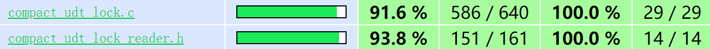

# Testing Results for compact_udt_lock
Following [ckb-contract-guidelines](https://github.com/nervosnetwork/ckb-contract-guidelines)

### Rule 1: 100% test coverage

Execute the script ```tests/compact_udt/run-coverage.sh``` to run whole test case and generate test report.
* The script depend on the ```lcov``` and ```genhtml``` commands, if you don’t need generate web page report, you can comment out them.
* Code testing uses simulated data generated by compact_udt_rust.

The final results is:


1. Already checked condition makes some code unreachable, for example, the following ASSERT(false)
is unreachable due to being checked before use.

```C
if (hash_length) {
  err = blake2b_update(ctx, (char*)&len, sizeof(uint64_t));
  CUDT_CHECK2(err == 0, CKBERR_UNKNOW);
}
uint64_t offset = (len > ONE_BATCH_SIZE) ? ONE_BATCH_SIZE : len;
err = blake2b_update(ctx, temp, offset);
CUDT_CHECK2(err == 0, CKBERR_UNKNOW);
while (offset < len) {
  uint64_t current_len = ONE_BATCH_SIZE;
  err = ckb_load_witness(temp, &current_len, start + offset, index, source);
  if (err != CKB_SUCCESS) {
    return err;
  }
  uint64_t current_read =
      (current_len > ONE_BATCH_SIZE) ? ONE_BATCH_SIZE : current_len;
  err = blake2b_update(ctx, temp, current_read);
  CUDT_CHECK2(err == 0, CKBERR_UNKNOW);
  offset += current_read;
}

```

2. Some code about the verification of the molecule.


### Rule 2: Multiple execution environment for tests

#### Normal CKB-VM as used in CKB
After compiling the complete project in the root directory, execute it in ```tests/compact_udt_rust```:
```bash
cargo test
```

#### LLVM Undefined Behavior Sanitizer
See below.

#### LLVM Address Sanitizer
Execute the script ```tests/compact_udt/run-sanitizer.sh```.
